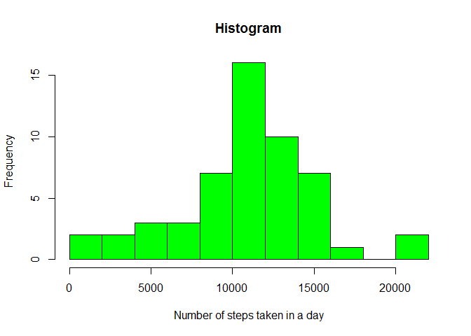
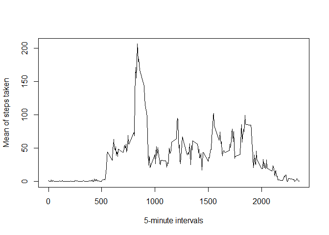
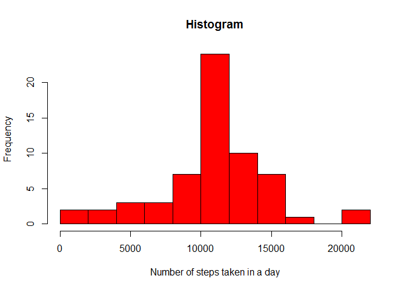
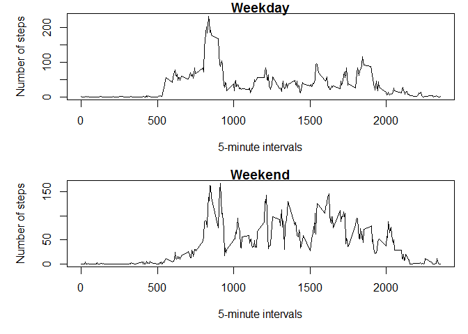

# Reproducible Research: Peer Assessment 1
Author: Iago Lopez

## Loading and preprocessing the data

```r
a1 <- read.csv("activity.csv")
```

## What is mean total number of steps taken per day?
*For this part of the assignment, you can ignore the missing values in the dataset.*

```r
a2 <- na.omit(a1)
```
*1.- Calculate the total number of steps taken per day.*

```r
aggregate(a2$steps, by=list(Day=a2$date), FUN=sum)
```

```
##           Day     x
## 1  2012-10-02   126
## 2  2012-10-03 11352
## 3  2012-10-04 12116
## 4  2012-10-05 13294
## 5  2012-10-06 15420
## 6  2012-10-07 11015
## 7  2012-10-09 12811
## 8  2012-10-10  9900
## 9  2012-10-11 10304
## 10 2012-10-12 17382
## 11 2012-10-13 12426
## 12 2012-10-14 15098
## 13 2012-10-15 10139
## 14 2012-10-16 15084
## 15 2012-10-17 13452
## 16 2012-10-18 10056
## 17 2012-10-19 11829
## 18 2012-10-20 10395
## 19 2012-10-21  8821
## 20 2012-10-22 13460
## 21 2012-10-23  8918
## 22 2012-10-24  8355
## 23 2012-10-25  2492
## 24 2012-10-26  6778
## 25 2012-10-27 10119
## 26 2012-10-28 11458
## 27 2012-10-29  5018
## 28 2012-10-30  9819
## 29 2012-10-31 15414
## 30 2012-11-02 10600
## 31 2012-11-03 10571
## 32 2012-11-05 10439
## 33 2012-11-06  8334
## 34 2012-11-07 12883
## 35 2012-11-08  3219
## 36 2012-11-11 12608
## 37 2012-11-12 10765
## 38 2012-11-13  7336
## 39 2012-11-15    41
## 40 2012-11-16  5441
## 41 2012-11-17 14339
## 42 2012-11-18 15110
## 43 2012-11-19  8841
## 44 2012-11-20  4472
## 45 2012-11-21 12787
## 46 2012-11-22 20427
## 47 2012-11-23 21194
## 48 2012-11-24 14478
## 49 2012-11-25 11834
## 50 2012-11-26 11162
## 51 2012-11-27 13646
## 52 2012-11-28 10183
## 53 2012-11-29  7047
```
*2.- Make a histogram of the total number of steps taken each day.*

```r
a3 <- aggregate(a2$steps, by=list(Day=a2$date), FUN=sum)
hist(a3$x,
     main="Histogram", 
     xlab="Number of steps taken in a day",
     col="green",
     breaks=10)
```

 

*3.- Calculate and report the mean and median of the total number of steps taken per day.*

- Calculating the mean:

```r
mean(a3$x)
```

```
## [1] 10766.19
```
- Calculating the median:

```r
median(a3$x)
```

```
## [1] 10765
```

## What is the average daily activity pattern?
*1.- Make a time series plot of the 5-minute interval (x-axis) and the average number of steps taken, averaged across all days (y-axis)*

```r
a4 <- aggregate(a2$steps, by=list(Interval=a2$interval), FUN=mean)
plot(a4$Interval,a4$x,type = "l", xlab = "5-minute intervals", ylab = "Mean of steps taken")
```

 

*2.- Which 5-minute interval, on average across all the days in the dataset, contains the maximum number of steps?*

```r
a5 <- aggregate(a2$steps, by=list(Interval=a2$interval), FUN=sum)
int_max <- which(a5[,2]==max(a5$x))
a5[int_max,]
```

```
##     Interval     x
## 104      835 10927
```

## Imputing missing values
*1.- Calculate and report the total number of missing values in the dataset.*

'a1' is the full dataset (with NA).

'a2' is the dataset without the missing values (no NA).

```r
nrow(a1) - nrow(a2)
```

```
## [1] 2304
```
*2.- Devise a strategy for filling in all of the missing values in the dataset.*

- Sustitute missing values (NA) with the mean for that 5-minute interval.

*3.- Create a new dataset that is equal to the original dataset but with the missing data filled in.*

'a1' is the full dataset (with NA).

'a2' is the dataset without the missing values (no NA).

'a4' is the dataset of the mean for every 5-minute interval.

'a6' is a dataset with only the NA rows.

```r
a6 <- a1[is.na(a1),]
for(i in 1:nrow(a6)){
        n1 <- a6[i,3]
        n2 <- which(a4[,1]==n1)
        n3 <- a4[n2,2]
        a6[i,1] <- n3
}
```
Now 'a6' is a dataset with the NAs replaced with the mean for the 5-minute interval.

'a7' is the bind of 'a2' and the new 'a6'.

'a8' is 'a7' ordered by date.

```r
a7 <- rbind(a2,a6)
a8 <- a7[order(a7[,2]),]
```

*4.A- Make a histogram of the total number of steps taken each day.*

```r
a9 <- aggregate(a8$steps, by=list(Day=a8$date), FUN=sum)
hist(a9$x,
     main="Histogram", 
     xlab="Number of steps taken in a day",
     col="red",
     breaks=10)
```

 

*4.B- Calculate and report the mean and median total number of steps taken per day.*

- Calculating the mean:

```r
mean(a9$x)
```

```
## [1] 10766.19
```
- Calculating the median:

```r
median(a9$x)
```

```
## [1] 10766.19
```

*4.C- Do these values differ from the estimates from the first part of the assignment?*

- Difference of means:

```r
mean(a3$x) - mean(a9$x)
```

```
## [1] 0
```

- Difference of medians:

```r
median(a3$x) - median(a9$x)
```

```
## [1] -1.188679
```

*4.D- What is the impact of imputing missing data on the estimates of the total daily number of steps?*

- The mean remains the same.

- The median has changed a bit because now the most repeated data is the one that has been estimated. 

## Are there differences in activity patterns between weekdays and weekends?
*Use the dataset with the filled-in missing values for this part.*

*1.- Create a new factor variable in the dataset with two levels - "weekday" and "weekend" indicating whether a given date is a weekday or weekend day.*


```r
wnames <- as.Date(a8[,2])
for(i in 1:length(wnames)){
        a8[i,4] <- weekdays(wnames[i])
}
awday <- subset(a8, a8[,4]=="lunes"|
                      a8[,4]=="martes"|
                      a8[,4]=="miércoles"|
                      a8[,4]=="jueves"|
                      a8[,4]=="viernes")
awday[,5] <- "weekday"
awend <- subset(a8, a8[,4]=="sábado"|
                      a8[,4]=="domingo")
awend[,5] <- "weekend"
a10 <- rbind(awday,awend)
a11 <- a10[order(a10[,2]),]
a11[,5] <- as.factor(a11[,5])
```

*2.- Make a panel plot containing a time series plot of the 5-minute interval (x-axis) and the average number of steps taken, averaged across all weekday days or weekend days (y-axis).*

```r
a12 <- subset(a11,a11[,5]=="weekday")
a13 <- aggregate(a12$steps, by=list(Interval=a12$interval), FUN=mean)
a14 <- subset(a11,a11[,5]=="weekend")
a15 <- aggregate(a14$steps, by=list(Interval=a14$interval), FUN=mean)
par(mfrow=c(2,1),mar=c(5,5,1,1))
plot(a13$Interval,a13$x,type = "l", main = "Weekday", xlab = "5-minute intervals", ylab = "Number of steps")
plot(a15$Interval,a15$x,type = "l", main = "Weekend", xlab = "5-minute intervals", ylab = "Number of steps")
```

 
